---

## Anti-Cheat System

**A modular anti-cheat framework designed to detect and prevent common cheating techniques in FPS-style games. Inspired by Valorant’s Vanguard system, this project focuses on detection components without invasive enforcement.**

[Architecture](docs/sentinelsystem_architecture.md) ·
[Detection Components](docs/detection_components.md) ·
[Tests](tests/) ·
[Source](src/)

---

## Overview

SentinelGuard is a modular anti-cheat framework that detects and prevents common cheating techniques in first-person shooter (FPS) games. It includes components for detecting a variety of cheating methods such as aimbots, wallhacks, and more, while focusing on providing detection without enforcement.

```mermaid
flowchart TB
    A["Detection Configuration<br/>Capture · Rules · Output"] --> B["SentinelGuard Core"]

    B --> C["Detection Engine<br/>Real-time Cheating Detection"]
    C --> D["Alert Pipeline<br/>Structured Events"]

    D --> E1["Machine Output<br/>alerts.jsonl"]
    D --> E2["Human Output<br/>alerts.log / console"]

    F["Live Game Data"] --> B
```

---

## 📁 Repository Structure

- **`src/`**  
  Contains the source code scripts for each anti-cheat module. Each script implements a distinct detection or defense mechanism.

- **`docs/`**  
  Detailed documentation for every component, explaining its purpose, implementation details, and usage instructions.

- **`logs/`**  
  Stores runtime log files generated by the anti-cheat modules, including alerts, detections, and errors.

- **`keys/`**  
  Holds cryptographic key files (public and private RSA keys) used for signing and verification within select modules.

- **`baseline/`**  
  Contains encrypted baseline files and their corresponding digital signatures used for integrity verification.

> [!CAUTION]
> Cryptographic keys included in this repository are **for lab and demonstration purposes only** and must never be reused in a real-world or production environment.

---

## 📚 Component Documentation

### [File Integrity Checker](docs/file_integrity.md)  
Detects unauthorized modifications to critical game files by comparing cryptographic hashes against a digitally signed baseline.

### [Memory Monitor](docs/memory_monitor.md)
Monitors system memory to detect suspicious patterns indicating code injection or memory tampering.

### [Kernel Monitor](docs/kernel_monitor.md) (Work In Progress)  
Tracks kernel-level driver activity to identify unauthorized or malicious kernel modules.

### [Process Watcher](docs/process_watcher.md) (Work In Progress)  
Watches running processes and flags blacklisted or anomalous behavior indicative of cheat tools.

### [Input Logger Detector](docs/input_logger_detector.md) (Work In Progress)  
Detects unusual input patterns or injected inputs that may result from macros or keyloggers.

### [Network Sniffer Blocker](docs/network_sniffer_blocker.md) (Work In Progress)  
Identifies tools attempting to intercept or inspect game traffic.

### [Behavior Analysis](docs/behavior_analysis.md) (Work In Progress)  
Analyzes player behavior data to detect aimbots, wallhacks, or other automated cheating strategies.

---

## 🚀 Getting Started

To run a specific module, execute its corresponding script inside the `src/` directory.
Refer to the documentation for each component to understand setup requirements and usage details.

---

## License

This project is licensed under the [MIT License](LICENSE).
