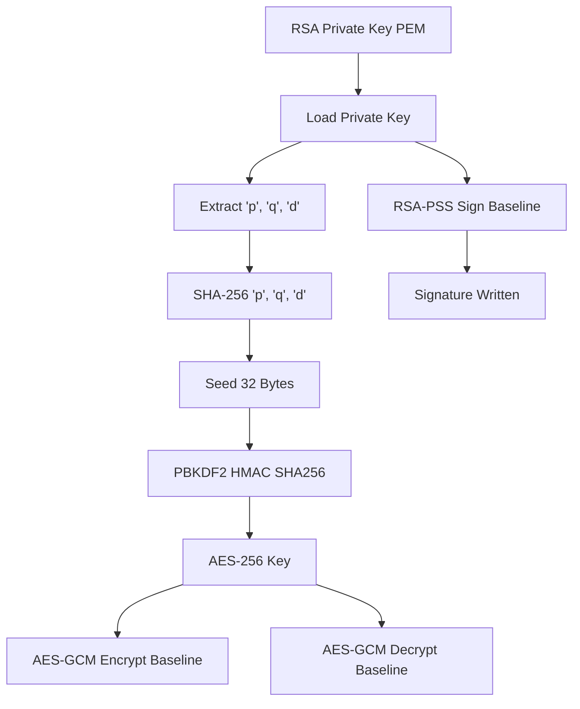

# File Integrity Module (`file_integrity.py`)

The File Integrity Module is a cryptographically enforced anti-tamper subsystem within the **ClearSight Anti-Cheat framework**. Its purpose is to detect unauthorized modification of the anti-cheat itself, game assets, and runtime conditions, then respond with deterministic, logged termination events.

This module is designed to be **auditable, research-focused, and deterministic**, prioritizing clarity of logic and cryptographic correctness over adversarial obfuscation.

[Source code](https://github.com/VenalityXT/Anti-Cheat-Project/blob/main/src/file_integrity.py)  

> [!IMPORTANT]  
> This module is intended for **controlled lab and research environments**.  
> Anti-reversing techniques such as obfuscation, packing, and virtualization are intentionally excluded to keep the system **observable**, **testable**, and **verifiable** for security research and detection engineering.

---

## Overview

The File Integrity Module enforces the following protections:

- Self-integrity verification of the anti-cheat module itself
- Cryptographically signed integrity baselines
- Recursive file integrity monitoring of the game directory
- Deterministic AES key derivation without stored secrets
- Honeyfile tripwire detection
- Optional debugger detection with development override
- Structured logging with standardized termination codes

When a validated tamper condition is detected, the module simulates a forced game termination and records the event under the `[CRITICAL]` log level.

---

## Runtime Control Flow

The File Integrity Module operates across **two conceptual layers**:  
a high-level enforcement architecture that emphasizes security decisions and failure paths, and a lower-level execution flow that reflects how the logic is implemented in code.

To support both perspectives, the runtime behavior is documented using **two complementary diagrams**.

### High-Level Enforcement Architecture (Conceptual)

The following static flowchart presents a **system-level view** of the module’s runtime behavior. It emphasizes:

- Security boundaries and trust decisions  
- Validation checkpoints and enforcement gates  
- Non-recoverable failure paths and termination conditions  
- The relationship between self-integrity, file-integrity, and monitoring logic  

This diagram is intended to communicate **what the system enforces and why**, rather than the precise order of function calls.


### Execution Flow (Implementation-Level)

The following Mermaid diagram documents the **runtime execution flow** as implemented in `file_integrity.py`. It focuses on:

- Function sequencing and control flow  
- Loop structure and execution order  
- Decision points as they occur during runtime  
- How enforcement logic is reached in code  

This view is intentionally closer to the implementation and is meant to aid code review, maintenance, and auditability.

```mermaid
flowchart LR
A[Program Start] --> B[Initialize Logging] --> C[Monitor]

C --> D[Verify Self Integrity]
D --> E[Hash file_integrity.py]
E --> F{Self Baseline Exists}

F -->|No| G[Create Self Baseline]
G --> H[Sign Baseline RSA-PSS]
H --> I[Continue Execution]

F -->|Yes| J{Hash Matches}
J -->|No| K[Terminate FI-SI-002]
J -->|Yes| I

I --> L[Initial Directory Scan]
L --> M[Recursive Walk]
M --> N[Canonicalize Paths]
N --> O[Apply Exclusion Rules]
O --> P[SHA-256 File Hashing]
P --> Q[Shuffle Scan Order]
Q --> R[Baseline Snapshot In Memory]

R --> S[Monitoring Loop]

S --> T{Debugger Detected}
T -->|Yes| U[Terminate FI-DBG-001]
T -->|No| V[Rescan Directory]

V --> W[Current Snapshot]
W --> X{Baseline Matches}

X -->|No| Y[Terminate FI-INT-001]
X -->|Yes| Z[Sleep With Jitter]
Z --> S
```



---

## Baseline Architecture

The module maintains **two independent integrity baselines**, each with a distinct purpose and threat model.

### Self-Integrity Baseline

The self-integrity baseline protects the anti-cheat module from modification.

Stored at:
- `ClearSight/data/baseline/self_integrity.bin`
- `ClearSight/data/baseline/self_integrity.sig`

This baseline contains:
- A SHA-256 hash of `file_integrity.py`
- An RSA-PSS signature over the hash

Any modification to the module source invalidates the baseline and results in immediate termination.

### File-Integrity Baseline

The file-integrity baseline protects the monitored game directory.

Stored at:
- `ClearSight/data/hashes.json.enc`
- `ClearSight/data/hashes.json.sig`

This baseline contains:
- A mapping of `{ absolute_path : sha256_hash }`
- Encrypted with AES-256-GCM
- Signed with RSA-PSS

Any deviation between current and baseline file state results in a termination event.

> [!CAUTION]  
> If the monitored directory structure or file set changes legitimately, **both baselines must be deleted and regenerated**.  
> Failure to do so will result in guaranteed integrity violations.

---

## Directory and Path Design

The module enforces strict path normalization and separation of concerns.

Default layout:
- `GAME_DIRECTORY` contains game assets only
- `ClearSight/` contains anti-cheat code, keys, logs, and baselines
- `honeypot.dat` is placed at the root of `GAME_DIRECTORY`

This design ensures:
- Anti-cheat assets are never confused with game assets
- Baseline files cannot be mistaken for legitimate game content
- Canonical paths prevent traversal and duplicate-hash evasion

---

## Self-Integrity System

The self-integrity mechanism executes on every launch:

1. Compute SHA-256 hash of `file_integrity.py`
2. Load the stored self-integrity baseline
3. Verify the RSA-PSS signature
4. Compare stored hash to the current hash

If a mismatch is detected:
- Production mode triggers `[CRITICAL] FI-SI-002`
- Development mode regenerates the baseline automatically

This guarantees that enforcement logic cannot be silently modified.

---

## File-Integrity System

The file-integrity system monitors all valid files under `GAME_DIRECTORY`.

Excluded content:
- Directories listed in `EXCLUDED_FOLDERS`
- File extensions listed in `EXCLUDED_EXTENSIONS`

Process:
- Files are canonicalized and recursively enumerated
- SHA-256 hashes are computed per file
- Scan order is randomized to resist timing-based tampering
- Results are compared against the decrypted baseline

Any mismatch triggers a termination event.

---

## Honeyfile System

A deliberate tripwire file named `honeypot.dat` is placed in the game directory.

Rules:
- The game never reads or writes this file
- The anti-cheat expects the file to exist unchanged
- Any deletion, modification, or replacement triggers termination

This mechanism detects mass-modification tools and indiscriminate cleanup attempts.

---

## Debugger Detection

The module detects debugging via:

- Python tracing (`sys.gettrace`)
- Native Windows debugger checks (`IsDebuggerPresent`)

Behavior:
- Production mode terminates immediately with `FI-DBG-001`
- Development mode logs a warning and continues execution

> [!WARNING]  
> Debugger detection may trigger false positives in advanced instrumentation environments.

---

## AES Key Derivation Architecture

To eliminate static secrets, the AES encryption key is **derived at runtime** from RSA private key material.



This design ensures:
- No AES keys exist on disk
- Only the correct private key can decrypt baselines
- Key tampering invalidates the entire system

---

## Logging System

The module uses structured severity levels:

- `[INFO]` — Normal operation
- `[WARNING]` — Suspicious but non-fatal behavior
- `[ERROR]` — Recoverable integrity issues
- `[CRITICAL]` — Guaranteed termination events

Example critical log entry:

```text
2025-12-11 12:41:22,118 [FILE_INTEGRITY] [CRITICAL] [FI-INT-001]
Terminating simulated game process (PID = 4211) - Reason: Integrity violation detected
```

Logs are written to:
- `ClearSight/logs/file_integrity.log`

Directories are created automatically if missing.

---

## Integrity Violation Codes

| Code        | Meaning |
|------------|---------|
| FI-KEY-001 | Missing RSA private key |
| FI-SI-001  | Self-integrity signature invalid |
| FI-SI-002  | Anti-cheat module modified |
| FI-BL-001  | Baseline signature invalid |
| FI-BL-002  | Baseline decryption failed |
| FI-HF-001  | Honeyfile modified or missing |
| FI-DBG-001 | Debugger detected |
| FI-INT-001 | Integrity violation detected |
| FI-INT-002 | Missing game files |
| FI-INT-003 | Unexpected new files |

---

## Development Workflow

During development:
- Enable `DEV_MODE`
- Baselines regenerate automatically
- Debugger detection is bypassed
- Termination events are logged but non-blocking

Before production:
- Disable `DEV_MODE`
- Regenerate final baselines
- Protect key and baseline directories from modification

---

## Summary

The File Integrity Module provides:

- Deterministic tamper detection
- Self-protection against modification
- Cryptographically enforced baselines
- Runtime debugger awareness
- Honeyfile-based tripwire detection
- Structured enforcement and logging

It is intentionally designed to be **educational, auditable, and extensible**, emphasizing correctness and transparency over adversarial concealment.

End of `docs/file_integrity.md`.
