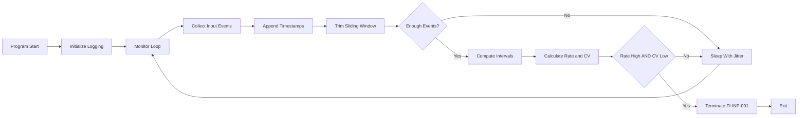

# Input Logger Detector Module (`input_logger.py`)

The Input Logger Module is a **behavioral input-analysis subsystem** within the **SentinelGuard Anti-Cheat framework**. Its purpose is to detect **non-human input patterns**, including those produced by **auto-clickers, macros, and injected input mechanisms**, and respond with deterministic, logged enforcement events.

This module is designed to be **auditable, research-focused, and behavior-driven**, emphasizing **statistical input analysis** over signature-based detection or invasive system hooks.

[SOURCE CODE](https://github.com/VenalityXT/Anti-Cheat-Project/blob/main/src/input_logger_detector.py)

> [!IMPORTANT]  
> This module is intended for **controlled lab and research environments**.  
> Kernel-level hooks, HID drivers, and hardware-based macro detection are intentionally excluded to preserve **observability**, **testability**, and **clear threat-model boundaries**.

---

## Overview

The Input Logger Detector enforces the following protections:

- Continuous monitoring of keyboard and mouse input activity  
- Detection of abnormally high input rates  
- Detection of unnaturally uniform input timing  
- Behavioral classification using statistical variance analysis  
- Deterministic termination using standardized event codes  
- Structured logging for audit and forensic review  

When a validated non-human input pattern is detected, the module simulates a forced game termination and records the event under the `[CRITICAL]` log level.

---

## Runtime Control Flow

The Input Logger Detector operates across **two conceptual layers**:  
a behavioral enforcement model that defines *what constitutes non-human input*, and a lower-level execution flow that reflects how input signals are collected and analyzed in code.

To support both perspectives, the runtime behavior is documented using a **single implementation-level execution diagram**.

### Execution Flow (Implementation-Level)

The following Mermaid diagram documents the **runtime execution flow** as implemented in `input_logger_detector.py`. It focuses on:

- Input collection and buffering  
- Sliding-window analysis  
- Statistical decision points  
- Enforcement paths  



---

## Detection Architecture

The Input Logger Detector relies on **behavioral signals**, not static signatures.

### Input Collection Layer

The module collects timestamps for:
- Mouse button presses (primary detection vector)
- Keyboard state polling (supporting signal)

All events are stored in a **sliding time window**, preserving short-term temporal relationships critical for detecting automation.

---

### Statistical Analysis Layer

Rather than using raw variance alone, the module computes the **Coefficient of Variation (CV)**:

- CV = Standard Deviation / Mean Interval  
- Normalizes timing irregularity across input speeds  
- Resistant to basic jitter added by modern auto-clickers  

Detection is based on **combined conditions**:
- Excessive input rate  
- Highly regular timing  

This reduces false positives caused by:
- Skilled players  
- Rapid but irregular human input  
- Legitimate accessibility tools in non-enforcement modes  

---

## Behavioral Escalation Model

The module does **not** enforce termination on single events.

Instead:
- Input events are aggregated over a short sliding window  
- Analysis only occurs once a minimum event count is reached  
- Enforcement requires **multiple correlated indicators**  

This ensures that:
- Random bursts do not trigger enforcement  
- Accidental rapid input is tolerated  
- Only sustained automation patterns escalate  

> [!NOTE]  
> This module does **not attempt to detect keyloggers directly**.  
> Instead, it detects **input behavior that is statistically inconsistent with human interaction**, which may result from macros, auto-clickers, or injected input sources.

---

## Detection Scope and Limitations

The Input Logger Detector operates entirely in **user mode**.

As a result:

- Kernel-level HID spoofing is out of scope  
- Hardware-based macros are not visible  
- Advanced driver-based injection cannot be reliably detected  

These limitations are **explicitly acknowledged** and align with the module’s research-oriented threat model.

---

## Logging System

The module uses structured severity levels:

- `[INFO]` — Module startup and loop initialization  
- `[WARNING]` — Suspicious but non-fatal input behavior (development mode)  
- `[ERROR]` — Recoverable input inspection failures  
- `[CRITICAL]` — Confirmed automation detection and termination  

Example critical log entry:

```text
2025-12-11 12:41:22,118 [INPUT_DETECTOR] [CRITICAL] [FI-INP-001]
Terminating protected process (PID = -1) - Reason: Detected highly regular high-frequency input
```

Logs are written to:
- `ClearSight/logs/input_logger_detector.log`

Log directories are created automatically if missing.

---

## Integrity Violation Codes

| Code        | Meaning                                              |
|------------|------------------------------------------------------|
| FI-INP-001 | Non-human input pattern detected (macro / auto-clicker) |
| FI-INP-002 | Input monitoring failure                             |
| FI-DBG-001 | Debugger detected                                    |

---

## Development Workflow

During development:

- Enable `DEV_MODE`  
- Detection events are logged but non-blocking  
- Thresholds can be tuned safely  
- Input behavior can be observed in real time  

Before production:

- Disable `DEV_MODE`  
- Validate thresholds against normal gameplay  
- Correlate with other modules (Memory, Process Watcher)  
- Treat enforcement events as non-recoverable  

---

## Summary

The Input Logger Detector Module provides:

- Behavior-based detection of automated input  
- Statistical resistance to jitter-based evasion  
- Clear and auditable enforcement logic  
- Seamless integration with SentinelGuard modules  

It is intentionally designed to be **educational, auditable, and extensible**, prioritizing correctness and transparency over adversarial concealment.

End of `docs/input_logger_detector.md`.
