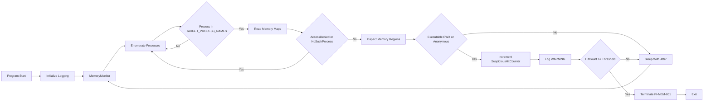

# Memory Monitor Module (`memory_monitor.py`)

A runtime memory monitoring subsystem within the **ClearSight Anti-Cheat framework**. This module inspects process memory mappings to detect suspicious executable regions commonly associated with **code injection** and **in-memory tampering**, then responds with deterministic, logged termination events.

[SOURCE CODE](https://github.com/VenalityXT/Anti-Cheat-Project/blob/main/src/memory_monitor.py)

> [!IMPORTANT]  
> This module is intended for **controlled lab and research environments**.  
> **Code obfuscation** and **anti-reversing measures** are intentionally **not implemented** to maintain **observability**, **testability**, and **debuggability** for research and detection validation.

---

## Overview  

The Memory Monitor performs the following functions:

- Scans protected process memory mappings for suspicious executable regions indicating potential injection or tampering  
- Flags executable memory regions that are **writable (RWX)** or **anonymous (no backing file path)**  
- Logs suspicious memory detections at the `[WARNING]` level  
- Uses a repeated-hit threshold to reduce false positives before enforcement  
- Terminates the protected process when the enforcement threshold is met or when a fatal memory scanning error occurs  
- Logs events using `[INFO]`, `[WARNING]`, `[ERROR]`, and `[CRITICAL]` levels  

When a validated memory tampering condition is confirmed, the module triggers a simulated forced termination recorded under `[CRITICAL]`.

---

## Runtime Control Flow

The Memory Monitor Module operates across **two conceptual layers**:  
a high-level enforcement architecture that emphasizes security decisions and failure paths, and a lower-level execution flow that reflects how memory scanning and enforcement logic are implemented in code.

To support both perspectives, the runtime behavior is documented using **two complementary diagrams**.

### High-Level Enforcement Architecture (Conceptual)

The following static flowchart presents a **system-level view** of the Memory Monitor’s runtime behavior. It emphasizes:

- Trust boundaries between monitored and non-monitored processes  
- Memory classification and enforcement decision points  
- Non-recoverable failure paths and termination conditions  
- The relationship between scanning, detection thresholds, and enforcement  

This diagram is intended to communicate **what the system enforces and why**, rather than the precise order of function calls.

### Execution Flow (Implementation-Level)

The following Mermaid diagram documents the **runtime execution flow** as implemented in `memory_monitor.py`. It focuses on:

- Function sequencing and control flow  
- Loop structure and execution order  
- Decision points as they occur during runtime  
- How enforcement logic is reached in code  

This view is intentionally closer to the implementation and is meant to aid code review, maintenance, and auditability.

---

## Memory Monitoring Architecture

The Memory Monitor uses `psutil` to enumerate running processes and inspect memory mappings. Instead of treating all executable memory as suspicious (high false positive risk), it evaluates **permission combinations** and **backing characteristics** that are more strongly correlated with injection-style behavior.

### Main Components:

1. **Process Scope Control**  
   Restricts scanning to `TARGET_PROCESS_NAMES` to reduce noise and avoid irrelevant system processes.

2. **Suspicious Region Classification**  
   A region is considered suspicious when it is:
   - **Executable and writable** (RWX), or
   - **Executable and anonymous** (no backing file path)

3. **Behavioral Escalation**  
   Suspicious hits are tracked per PID and enforced only after `SUSPICIOUS_HIT_THRESHOLD` is reached.

4. **Sleep With Jitter**  
   Scan intervals include jitter to reduce timing-based evasion.

---

## Memory Monitoring Process

The module works as follows:

1. **Memory Scan**  
   Enumerates target processes and inspects their memory maps.

2. **Classification**  
   Flags suspicious memory regions based on:
   - `perms` (permission flags)
   - `path` (backing file path)
   - `addr` (region address)

3. **Logging**  
   Logs suspicious regions at `[WARNING]` and increments hit counters.

4. **Enforcement**  
   If repeated detection reaches the threshold, enforcement triggers termination using `FI-MEM-001`.

---

## Memory Scan Error Handling

During scanning, certain errors are expected and handled gracefully:

- `psutil.AccessDenied`
- `psutil.NoSuchProcess`
- transient memory map access failures

These events are logged and scanning continues.

Only unrecoverable scanning failures result in termination using `FI-MEM-002`.

---

## Logging System

The module uses four severity levels:

- `[INFO]` — Normal operations, such as startup and loop initialization  
- `[WARNING]` — Suspicious activity detected, such as RWX or anonymous executable regions  
- `[ERROR]` — Recoverable scanning issues or unexpected exceptions  
- `[CRITICAL]` — Termination events  

Example `[CRITICAL]` entry:

Xtext
2025-12-11 12:41:22,118 [MEMORY_MONITOR] [CRITICAL] [FI-MEM-001]
Terminating protected process (PID = 4211) - Reason: Repeated detection of suspicious executable memory
X

All logs are written to:

`ClearSight/logs/memory_monitor.log`

If the `logs/` directory does not exist, it is automatically created.

---

## Integrity Violation Codes

The module uses standardized event codes:

| Code        | Meaning                                             |
|------------|-----------------------------------------------------|
| FI-MEM-001 | Repeated detection of suspicious executable memory |
| FI-MEM-002 | Fatal memory scanning error                        |
| FI-DBG-001 | Debugger detected                                  |

---

## Development Workflow

During development:

- Enable `DEV_MODE = True`  
- Observe `[WARNING]` events to tune thresholds and validate detection logic  
- Debugger detection is ignored, and enforcement can be tested safely in a lab environment  

Before production:

- Disable `DEV_MODE`  
- Confirm `TARGET_PROCESS_NAMES` is accurate  
- Validate threshold behavior against benign workloads  
- Protect configuration and log paths from modification  

---

## Runtime Flow

---

## Summary

The Memory Monitor forms a critical part of the ClearSight Anti-Cheat system by providing:

- Suspicious executable memory detection focused on RWX and anonymous executable regions  
- Threshold-based enforcement to reduce false positives  
- Deterministic termination logic with standardized event codes  
- Structured logging to support auditing and detection validation  
- Jitter-based timing to reduce predictable scan patterns  

It is designed to be **secure**, **reliable**, and **research-focused**, emphasizing clarity and observability over concealment.

---

End of `docs/memory_monitor.md`.
