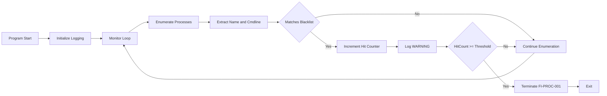

# Process Watcher Module (`process_watcher.py`)

The Process Watcher Module is a **runtime process inspection subsystem** within the **ClearSight Anti-Cheat framework**. Its purpose is to identify **disallowed, blacklisted, or anomalous processes** indicative of cheat tools, debuggers, or runtime manipulation utilities, then respond with deterministic, logged termination events.

This module is designed to be **auditable, research-focused, and behavior-driven**, prioritizing clarity of detection logic and signal validation over stealth or adversarial obfuscation.

[SOURCE CODE](https://github.com/VenalityXT/Anti-Cheat-Project/blob/main/src/process_watcher.py)

> [!IMPORTANT]  
> This module is intended for **controlled lab and research environments**.  
> Kernel drivers, service-level inspection, and process-hiding countermeasures are intentionally excluded to keep the system **observable**, **testable**, and **verifiable** for security research and detection engineering.

---

## Overview

The Process Watcher Module enforces the following protections:

- Continuous enumeration of running processes  
- Detection of explicitly blacklisted process names  
- Optional command-line inspection for service-hosted binaries  
- Behavioral escalation using repeated-hit thresholds  
- Deterministic termination logic with standardized event codes  
- Structured logging for audit and review  

When a validated disallowed or suspicious process condition is detected repeatedly, the module simulates a forced game termination and records the event under the `[CRITICAL]` log level.

---

## Runtime Control Flow

The Process Watcher Module operates across **two conceptual layers**:  
a high-level enforcement architecture that emphasizes trust boundaries and disallowed tooling, and a lower-level execution flow that reflects how process enumeration and enforcement are implemented in code.

To support both perspectives, the runtime behavior is documented using a **single implementation-level execution diagram**.

### Execution Flow (Implementation-Level)

The following Mermaid diagram documents the **runtime execution flow** as implemented in `process_watcher.py`. It focuses on:

- Function sequencing and control flow  
- Loop structure and execution order  
- Decision points as they occur during runtime  
- How enforcement logic is reached in code  

---

## Detection Architecture

The Process Watcher uses **explicit policy-based detection**, rather than heuristic or obfuscated techniques.

### Blacklist-Based Detection

A configurable set of known disallowed tools is defined, including:

- Memory scanners and editors  
- Debuggers and reverse engineering tools  
- Process manipulation and inspection utilities  

Detection is based on:
- Process executable name  
- Optional command-line inspection to identify service-hosted binaries  

This approach favors **low false positives**, **high explainability**, and **deterministic enforcement**, making it suitable for research and demonstration purposes.

> [!NOTE]  
> The blacklist defined in this module is **illustrative**, not authoritative.  
> Many real-world cheat tools and system services do **not expose stable or visible process names** in user-mode enumeration.

---

## Behavioral Escalation Model

The module does **not** enforce termination on first detection.

Instead, it uses a **threshold-based escalation model**:

- Each detection increments a per-process counter  
- Enforcement occurs only after repeated confirmation  
- Counters are scoped to process lifetime  

This model reduces false positives caused by:

- Transient background utilities  
- Short-lived helper processes  
- Benign tooling that briefly overlaps execution  

---

## Process Enumeration Limitations

The Process Watcher operates entirely in **user mode** and is therefore subject to operating system trust boundaries.

As a result:

- Protected system services may not appear as distinct processes  
- Service-hosted binaries may execute under shared hosts (for example, `svchost.exe`)  
- Certain processes may be inaccessible due to permission restrictions  

These limitations are **expected** and are explicitly acknowledged as part of the module’s threat model.

---

## Logging System

The module uses structured severity levels:

- `[INFO]` — Normal operation (startup, loop initialization)  
- `[WARNING]` — Detection of blacklisted or suspicious processes  
- `[ERROR]` — Recoverable enumeration or access errors  
- `[CRITICAL]` — Confirmed enforcement and termination events  

Example critical log entry:

Xtext
2025-12-11 12:41:22,118 [PROCESS_WATCHER] [CRITICAL] [FI-PROC-001]
Terminating protected process (PID = 5124) - Reason: Blacklisted process detected
X

Logs are written to:
- `ClearSight/logs/process_watcher.log`

Directories are created automatically if missing.

---

## Integrity Violation Codes

| Code        | Meaning                                    |
|------------|--------------------------------------------|
| FI-PROC-001 | Blacklisted or disallowed process detected |
| FI-PROC-002 | Fatal process enumeration error            |
| FI-DBG-001  | Debugger detected                          |

---

## Development Workflow

During development:

- Enable `DEV_MODE`  
- Detection events are logged but non-blocking  
- Debugger detection is bypassed  
- Blacklist rules can be tuned and observed safely  

Before production:

- Disable `DEV_MODE`  
- Finalize blacklist entries  
- Validate thresholds against benign workloads  
- Protect configuration and log paths from modification  

---

## Summary

The Process Watcher Module provides:

- Deterministic detection of disallowed processes  
- Behavioral escalation to reduce false positives  
- Clear and auditable enforcement logic  
- Structured logging suitable for forensic review  

It is intentionally designed to be **educational, auditable, and extensible**, emphasizing transparency and correctness over adversarial concealment.

End of `docs/process_watcher.md`.
